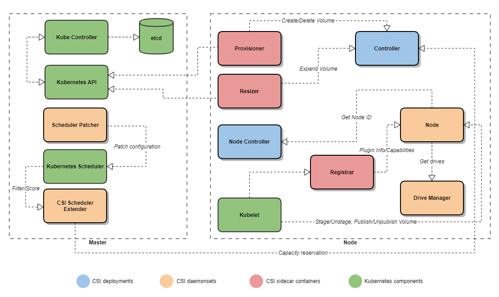

Bare-metal CSI Driver
=====================

Bare-metal CSI Driver is a [CSI spec](https://github.com/container-storage-interface/spec) implementation to manage locally attached disks for Kubernetes.

- **Project status**: Beta - no backward compatibility is provided   

Features
--------

- [Dynamic provisioning](https://kubernetes-csi.github.io/docs/external-provisioner.html): Volumes are created dynamically when `PersistentVolumeClaim` objects are created.
- Volume binding modes
  - WaitForFirstConsumer 
- Inline volumes
- LVM support
- Storage classes for the different drive types: HDD, SSD, NVMe
- Drive health detection
- Scheduler extender
- Support unique ID for each node in the K8s cluster
- Service procedures - node and disk replacement
- Volume expand support
- Raw block mode
- Ability to deploy on subset of nodes within cluster
- CSI Operator

### Planned features
- User defined storage classes
- NVMeOf support
- Kubernetes Scheduler
- SMART Self Test execution
- Volume cloning
- Support of additional Linux distributions/versions

Related repositories
--------------------
- [Bare-metal CSI Operator](https://github.com/dell/csi-baremetal-operator) - Kubernetes Operator to deploy and manage CSI
- [Bare-metal CSI Scheduling](https://github.com/dell/csi-baremetal-scheduling) - Kubernetes Scheduler and Scheduler Extender to guarantee correct pod placement

Installation process
--------------------

Installation process is documented in [Bare-metal CSI Operator](https://github.com/dell/csi-baremetal-operator)

High level architecture
-----------------------

Bare-metal CSI driver consists from the following components:
- Operator - responsible for CSI deployment and lifecycle (upgrade, node add/remove, etc.)
- Scheduler extender - handles `filter` and `score` requests coming from scheduler, requests capacity reservation from Controller service
- Scheduler patcher - automates scheduler configuration patching, optional component
- Controller service - handles Create/Delete/Expand Volume requests
- Node service - handles Volume Stage/Unstage, Publish/Unpublish requests
- Drive manager - discovers locally attach disks (drives)
- Node controller - maintains persistent node IDs

Contribution
------
Please refer [Contribution Guideline](https://github.com/dell/csi-baremetal/blob/master/docs/CONTRIBUTING.md) fo details
