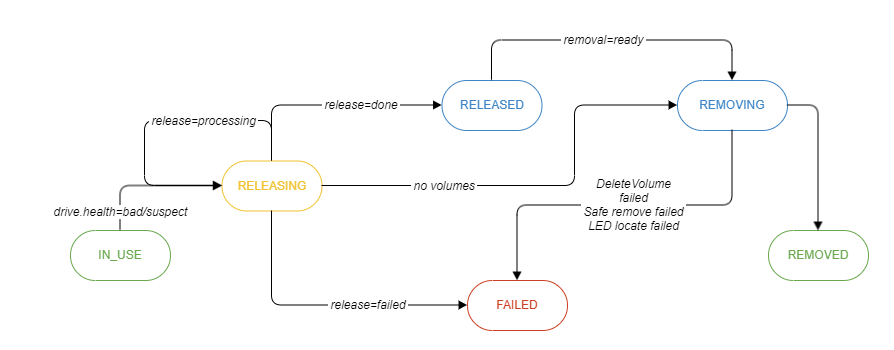

# Drive replacement procedure
<!-- toc -->
- [Summary](#summary)
- [Motivation](#motivation)
  - [Goals](#goals)
- [Proposal](#proposal)  
- [Design Details](#design-details)  
<!-- /toc -->
## Summary
Disk replacement is a feature which allows user to physically replace defective drive.

## Motivation
Once specific disk goes offline CSI driver should provide a way to gracefully detach it from the system and insert new healthy device instead.

Single drive can be used to store one or more persistent volumes. Persistent volumes can be owned by different applications which, in turn, can be managed by different Operators.

### Goals
- Develop algorithm for reactive and proactive drive replacement.
- Come up with the API between CSI, Operator and User.

## Proposal
To perform replacement of failed drive negotiation between CSI, Operator and User is required:

* BM CSI
  - Detects drive health
  - Triggers replacement process
  - Sends alerts
  - Prepares drive for physical replacement
* Operator
  - Instantiates recovery/replication process and monitor its progress if needed
  - Might reject procedure if system cannot release corresponding volume(s)
  - Deletes persistent volumes
* User
  - Triggers physical drive replacement process since drive might not be available yet when recovery of data is completed (to avoid data unavailability for applications with multiple persistence volumes per each replica)
## Design Details
### Drive health detection
Drive health is detected by drive manager and stored in the health field of [Drives CRD](https://github.com/dell/csi-baremetal-operator/blob/master/charts/csi-baremetal-operator/crds/csi-baremetal.dell.com_drives.yaml): 
- `GOOD` - drive is healthy. Application can safely use it.
- `SUSPECT` - drive might not be healthy. Replacement is recommended.
- `BAD` - drive is not healthy. Replacement is required.
- `UNKNOWN` - drive health not detected. Application should rely on IO errors.

Transition from SUSPECT/BAD health state to GOOD is not expected but must be handled.
### Drive usage statuses
[Drives CRD](https://github.com/dell/csi-baremetal/blob/master/api/v1/drivecrd/drive_types.go) is extended by the new field - usage status: 
- `IN_USE` - drive in use
- `RELEASING` - releasing in progress
- `RELEASED` - drive ready for removal
- `FAILED` - drive failed to remove
- `REMOVING` - removing in progress (PVs deletion, Safe remove, LED locate)
- `REMOVED` - drive removed

### Volume usage statuses
[Volumes CRD](https://github.com/dell/csi-baremetal/blob/master/api/v1/volumecrd/volume_types.go) is extended by the new field - usage status: 
- `IN_USE` - volume in use
- `RELEASING` - releasing in progress
- `RELEASED` - drive ready for removal
- `FAILED` - drive failed to remove

### API
#### Operator
Negotiation between CSI and Operator is be done though Volume CR. Operator can set the following annotations:
  - `release: processing` - system is working on data recovery/graceful IO shutdown
  - `release: done` - volume is released
  - `release: failed` - system failed to release volume
  - `recovery: [0:100]` - percent of recovery progress
  - `status: <status description>` - extra information. can be used to provide description for the release process. For example, *release=failed, recovery=50, status="recovery failed by timeout"*
#### User
To trigger physical drive removal user must put the following annotation on the corresponding Drive CR:
  - `removal: ready` - trigger physical removal procedure

### Detailed workflow diagram

## Other scenarios 
- User can initiate removal of a healthy drive by setting annotations `health=bad` or `health=suspect` on Drive CR, drive health will be overridden with the passed value
- Drive can be returned to `IN_USE` state from `FAILED` or `RELEASED` by setting annotation `action=add` on Drive CR
- Drive can be moved to `REMOVED` state from `FAILED` by setting annotation `action=remove` on Drive CR

# Workaround in Case of Failure
## Unmount Volume Procedure Fails
When the unmount volume procedure fails during the drive replacement process, the volume usage status is set to FAILED, causing the entire drive replacement procedure to fail. This failure typically occurs because the problematic volume is being used by another process and cannot be unmounted. The Container Storage Interface (CSI) is not able to automatically recover from this failure scenario, and a POD using a FAILED volume is not scheduled. To recover from this failure, the following actions are required from the user:

- Identify the Volume:
  * Locate the volume with a FAILED usage status.
  * Identify the corresponding Persistent Volume Claim (PVC) and POD.
- Remove PVC and POD:
  * Delete the identified PVC.
  * Delete the identified POD.
- Remove the Volume:
  * Delete the problematic volume.
- Verify Removal:
  * Ensure that after performing the above steps, the POD should be successfully scheduled.

