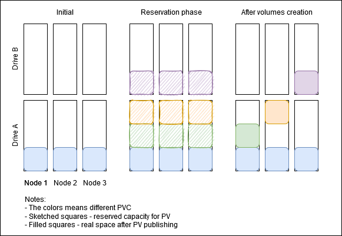
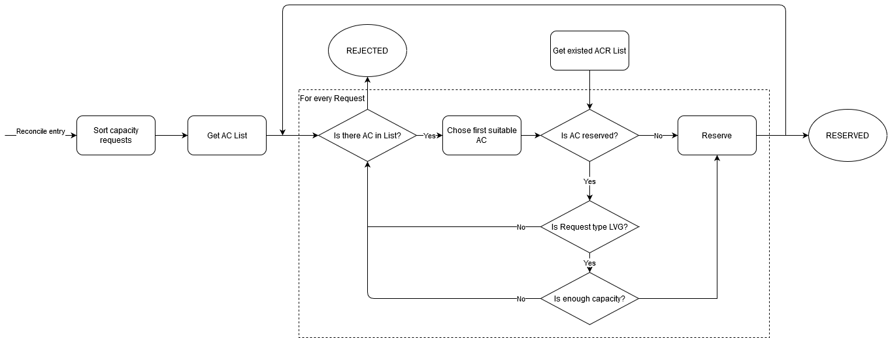

# Proposal: Refactoring of capacity planning

Last updated: 09.08.2021


## Abstract

Need to improve disk space usage for LVG based persistent volumes

## Background

Currently, 2 or more LVG PVs can be assigned to different disks on the reservation phase. It leads to the ineffective space usage.

Causes:
1. Reservation Controller doesn't consider on the planning phase, that LVG volumes should use one device.
   If ACR reserves non-LVG AC for LVG, other ACR won't be able to use the same drive for LVG until reservation is release or AC is converted.

2. CSI reserves capacity for PV on all nodes on the planning phase. 
   Extra reservation are released after Volume creation, but they affect each other, when controller selects corresponding drive. 
   Example of this situation is shown on the image below.

   

## Proposal

### Refactor the capacity planning algorithm
1. Map information of reserved ACs in ACR (add reserved capacity size).
```go
// From ACR
type ReservationRequest struct {
   CapacityRequest *CapacityRequest
   Reservations []string
}
type CapacityRequest struct {
   Name string
   StorageClass string
   Size int64
}

// For usage in the planning
type ReservedACs map[srting]*ReservedCapacity // ACName: {ACSize, ACType}
type ReservedCapacity struct {
    Reserved int64
    StorageClass string
}
```

2. Sort capacity requests from one CRD before processing.
    - By LVG/non-LVG (LVG first)
    - By capacity increasing in the group

Example:
```go
pvc1 (HDD) (10)
pvc2 (HDDLVG) (20)
pvc3 (HDDLVG) (10)
pvc4 (HDD) (100)
----------------
pvc3 (HDDLVG) (10)
pvc2 (HDDLVG) (20)
pvc1 (HDD) (10)
pvc4 (HDD) (100)
```

3. Sort ACs in `Get` function to create the persistent order (pv with LVG type will try to reserve place at first)
    - By capacity size
    - By UID in the group
    
4. The algorithm to reserve AC on one Node



Notes: 
1. The scenario above will be used for ACs with one Storage Type. 
   For example, if we need HDDLVG pvc, firstly we will try to find AC with HDDLVG type.
   
### Add feature "Minimization of disks number usage for LVG based volumes"

1. Add the opportunity for reservations with LVG Volumes to wait in Reconcile in the ACR controller until there are other ACRs with LVG Volumes in RESERVED state.
ACs will be reserved on all nodes only for one LVG Volume. It should make the controller to select the same drive for LVG volumes.
   
2. This functional will be optional, enabled by default. User can disable this option by pass parameter in helm chart values, if performance impact matters.

Performance issues: ISSUE-2, ISSUE-3

## Rationale

Kubernetes-sheduler can be used instead of Kubernetes-scheduler-extender: https://kubernetes.io/blog/2020/12/21/writing-crl-scheduler/.
It allows implementing additional actions on Reserve/Unreserve phase to avoid capacity reservation on all nodes.

## Compatibility

Need changes in csi-baremetal and csi-baremetal-operator

## Open issues (if applicable)

ID | Name | Descriptions | Status | Comments
---| -----| -------------| ------ | --------
ISSUE-1 | Inline volumes | Can we place inline volumes with PVs in LV?  |   |
ISSUE-2 | Performance impact | The proposed approach can increase PV provisioning time |   |
ISSUE-3 | Stacked ACR | If one of the LVG ACRs stacks in RESERVED, other ACRs will wait in REQUESTED |   | 
