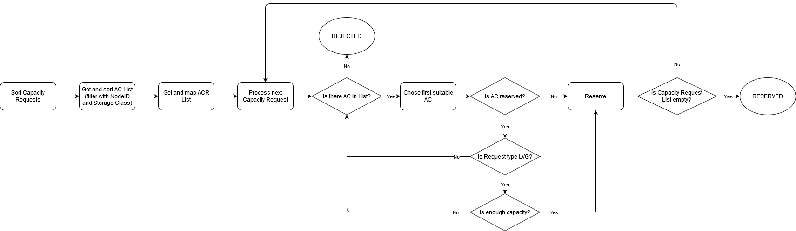

# Proposal: Refactoring of capacity planning

Last updated: 09.08.2021


## Abstract

Refactor logic of AC reservation to consider cases for 2 or more LVG PVs

## Background

Currently, 2 or more LVG PVs can be assigned to different disks on the reservation phase.
Reservation Controller doesn't consider on the planning phase, that LVG volumes should use one device.
It leads to the ineffective space usage.

## Proposal

### Refactor capacity planning algorithm
1. Map information of reserved ACs in ACR (add reserved capacity size).
```go
// From ACR
type ReservationRequest struct {
   CapacityRequest *CapacityRequest
   Reservations []string
}
type CapacityRequest struct {
   Name string
   StorageClass string
   Size int64
}

// For usage in the planning
type ReservedACs map[srting]*ReservedCapacity // ACName: {ACSize, ACType}
type ReservedCapacity struct {
    Reserved int64
    StorageClass string
}
```

2. Sort capacity requests from one CRD before processing.
    - By LVG/non-LVG (LVG first)
    - By capacity increasing in the group

Example:
```go
pvc1 (HDD) (10)
pvc2 (HDDLVG) (20)
pvc3 (HDDLVG) (10)
pvc4 (HDD) (100)
----------------
pvc3 (HDDLVG) (10)
pvc2 (HDDLVG) (20)
pvc1 (HDD) (10)
pvc4 (HDD) (100)
```

3. Sort ACs in `Get` function to create the persistent order (pv with LVG type will try to reserve place at first)
    - By capacity size
    - By UID in the group
    
4. The algorithm to reserve AC on one Node



Notes: 
1. The scenario above will be used for ACs with one Storage Type. 
   For example, if we need HDDLVG pvc, firstly we will try to find AC with HDDLVG type.
   
### Add feature "Consistent LVG volumes reservation"

## Rationale

TBD

## Compatibility

No compatibility with the previous versions.

## Implementation

TBD

## Open issues (if applicable)

ID | Name | Descriptions | Status | Comments
---| -----| -------------| ------ | --------
ISSUE-1 | Inline volumes  | Can we place inline volumes with PVs in LV?  |   |   
