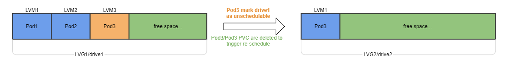
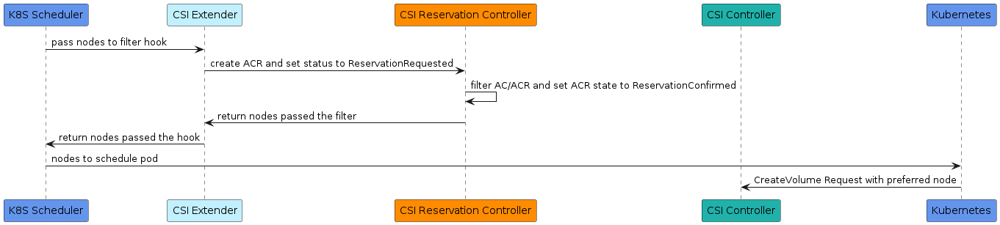
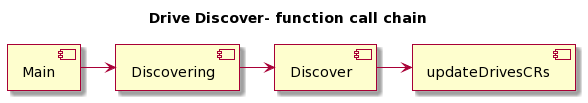
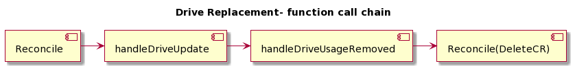

## Background

The proposal is driven by request from customer requirement [ISSUE-991](https://github.com/dell/csi-baremetal/issues/991) - A method to mark a disk drive unschedulable is desired for CSI IN DEVELOPMENT.The main concerns and motivation on the request as following,

This may provide a choice for applications when they encounter disk read/write errors. There might be a time gap between application hitting a disk error and CSI disk replacement workflow taking place. If an application can only wait for CSI disk replacement, it may need to panic on disk error situation repeatedly for a while, or use fake-attach method but with the risk of losing data. The application may want to proactively restart with new PVs scheduled on other healthy drives. So it needs to avoid being scheduled to the same drive.

The proposed work diagram is as below, taking LVG based storage class as example,


## Label to mark a drive as un-schedulable

A drive is a physical device that detect by CSI  drivemgr.  CSI underlying storage is backed by drives of different types,  hdd, ssd, nvme etc. 
In order to impact the scheduler process, we need to propose a proper label to mark the related drives, for simplicity, choose following labels,
```bash
drive.csi-baremetal.dell.com/taint:NoSchedule
```

we add this as a label to a drive custom resource.

```yaml
apiVersion: csi-baremetal.dell.com/v1
kind: Drive
metadata:
  labels:
    app: csi-baremetal
    app.kubernetes.io/name: csi-baremetal
    drive.csi-baremetal.dell.com/taint: NoSchedule
  name: f94dc766-2bb9-48b7-b0c4-1f680d2ec148
spec:
  ...
  Size: 7681000000000
  Slot: Slot 8 Bay 2
  Type: NVME
  UUID: f94dc766-2bb9-48b7-b0c4-1f680d2ec148
  ...
 
//AC label auto sync to the same
Name:         d919b573-122b-43f9-8891-6edeb78bec99
Namespace:
Labels:       app=csi-baremetal
              app.kubernetes.io/name=csi-baremetal
              drive.csi-baremetal.dell.com/taint=NoSchedule
Annotations:  <none>
API Version:  csi-baremetal.dell.com/v1
Kind:         AvailableCapacity
Metadata:
  UID:               0c34bb02-e7ad-4857-b0d3-aa199aca7a2d
Spec:
  Location:       f94dc766-2bb9-48b7-b0c4-1f680d2ec148
  Node Id:        5b86e5e0-5ff8-482a-9957-d1402461e909
  ...
```

## Scheduler process impact 

The key requirement is, 

> it needs to avoid being scheduled to the same drive.

In order to best satisfy this requirement, we need to do some work on csi extender process to impact the real schedule process. 
In CSI BareMetal, drive is not the basic scheduler unit but the AvailaleCapacity(ac) is.  ACs have connections with drives,  for non-lvg
storageclass,  a AC is 1:1 mapping to a physical drive.  and for lvg storageclass,  a lvg is 1:1 mapping to a physical drive.  
The typical scheduler extender process flow as following, 
k8s scheduler — > call hooks with k8s nodes items that passed the previous check — > extender  Filter function — > Created ACR 
--- > ACR reconcile — > handleReservatio — > filter AC/ACR and change ACR state to Confirmed — > return nodes passed the filter
--- > extender prioritize(score) — > CreateVolume — > DeleteACR/reduce AC size


## Proposed work items
1. for drives with the un-scheduler taint label tagged, auto sync the label to corresponding ACs.  
   - non-lvg drives and ac
   - lvg drives and ac,  for lvg ac,  the location in ac spec is lvg name it resides on. need to find out drive from lvg location.
2. add filter function in reservation stage. 
3. for drives with the un-scheduler taint label removed, auto removed the label in corresponding ACs.

## Open Issues
ID | Name | Descriptions | Status | Comments
---| -----| -------------| ------ | --------
ISSUE-1 | restrictions on disk taint | upper layer applications have the ability to mark a drive as un-schedulable, but it may have some mis-judge and cause the drive is un-usable by any of other workloads in cluster.  we should add some restriction on this. | Propose restriction methods and interface to users.  | Discussed with internal team, it is optional (not must have)
ISSUE-2 | interface to upper layer application |  is the label we proposed in section 1 appropriate for upper layer applications? |  Closed | ok now

## Corner Cases
### same drive remove/insert to node,  in others words,  hotplug a drive,  taint label should keep as the disk is there. 
#### Scenario 1
No Drive Replacement procedure involved.  drive CR will keep and not re-generated. This help maintain the drive taint label stay. 
CSI regards same disk by following functions, it cares Serial Number/PID/VID,  this indicate when it inserted back to a node (any slot), CSI takes it as same drive.

```golang
func (m *VolumeManager) drivesAreTheSame(drive1, drive2 *api.Drive) bool {
  return drive1.SerialNumber == drive2.SerialNumber &&
     drive1.VID == drive2.VID &&
     drive1.PID == drive2.PID
}
```


#### Scenario 2
Drive Replacement involved. That means drive health is BAD/SUSPECT. This automatically make this drive un-schedulable.
Drive is removed when DR procedure finished.


#### Conclusion
Same drive remove/insert to a node **WILL NOT** cause issues on disk taint feature.  This mechanism will work in this corner cases.
