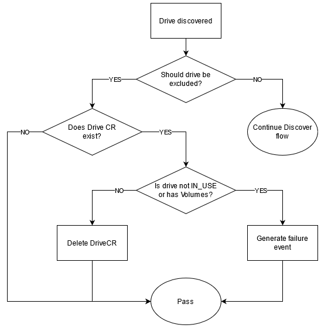

# Proposal: Specific drives excluding

Last updated: 07.02.2022


## Abstract

CSI Baremetal needs to have API for excluding specific drives from the common storage pool. 
Excluded drives won't be used for allocating new Volumes or LVGs.

## Background

CSI customers might not want to use some disks for whatever reason:
- for another application not managed by CSI
- as a workaround for any disk detection issues in CSI

So in these cases CSI haven't to allocate Volumes for some drives.

## Proposal

### User API

The rules to include/exclude drives based on:
- Size
- Type (HDD, SSD, ...)
- Serial Number
- PID
- VID
```yaml
driveRule:
    # include -> CSI will use drives, witch satisfy the following conditions ONLY
    # exclude -> CSI will detect all drives automatically except the passed ones
    strategy: include/exclude
    size:
        lessThen: 1Gi
        moreThen: 100Mi
    type:
      - HDD
    SN:
      - sn1
      - sn2
    PID:
      - ...
    VID:
      - ...
```

Settings can be set for all nodes in the cluster or for only one node. 
In the node section user chooses is global rules be applied or not.
```yaml
drive-rules.yaml:
  global:
    driveRule: ...
  nodes:
    - name: node1
      enableGlobal: true/false
      driveRule:
    - name: ...
```

#### Pass settings
Propose to process excluded drives on Discover stage in csi-baremetal-node part. 
Node container will take drive setting from the ConfigMap created with csi-baremetal-deployment.

Node ConfigMap can be updated in the following ways:
1. Set global drive rule on CSI installation.

Helm command for `csi-baremetal-driver` should be modified with:
```yaml
--set driver.node.global_drive_rule.size.more_then="1Gi" \
--set driver.node.global_drive_rule.in.SN={sn1, sn2, sn3}
```

The option to modify rules for specific nodes is not supported due to complex formatting.

2. After installing CSI user could edit a ConfigMap with CSI nodes setting to change included/excluded drives list.

For example:
```bash
# See current state
[root@servicenode ~]# kubectl describe cm node-config
Name:         node-config
Namespace:    default
Labels:       app=csi-baremetal-node
              app.kubernetes.io/managed-by=Helm
Annotations:  meta.helm.sh/release-name: csi-baremetal
              meta.helm.sh/release-namespace: default

Data
====
drive-rules.yaml:
----
global:
  driveRule:
      strategy: exclude
      size:
        lessThen: 1Gi
...
        
# Edit ConfigMap
[root@servicenode ~]# kubectl edit cm node-config

# Check ConfigMap content via using text processor, edit and save
---
# Please edit the object below. Lines beginning with a '#' will be ignored,
# and an empty file will abort the edit. If an error occurs while saving this file will be
# reopened with the relevant failures.
#
apiVersion: v1
data:
    drive-rules.yaml:
    ----
    global:
      driveRule:
          strategy: exclude
          size:
            lessThen: 1Gi
    nodes:
    - name: node1
      enableGlobal: true
      driveRule:
        strategy: exclude
        SN:
        - sn1
        - sn2
...
---

# See csi-baremetal-node logs and see that new settings confirmed
```


## Rationale

n/a

## Compatibility

n/a

## Implementation

#### Discover flow modification



## Open issues (if applicable)

| ID      | Name                                                                                                   | Descriptions                                                          | Status  | Comments                                      |
|---------|--------------------------------------------------------------------------------------------------------|-----------------------------------------------------------------------|---------|-----------------------------------------------|
| ISSUE-1 | Should we have option to include some drives on specific nodes in pool despite the common constraints? |                                                                       | APPLIED |                                               |   
| ISSUE-2 | Do we need to implement procedure to replace Volumes on another drive if this one was excluded?        | CSI can reduce drive size to 0 and wait until Volumes will be removed | REJECT  | Just sending event is enough                  |
| ISSUE-3 | Could Serial Number be used instead of or in addition to drive path?                                   | Use SN, PID, VID instead                                              | APPLIED | Drive path might be changed after node reboot |

