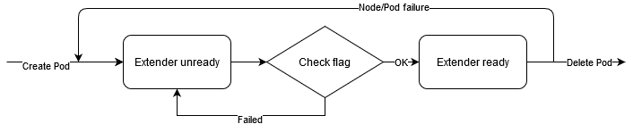
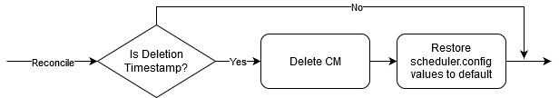
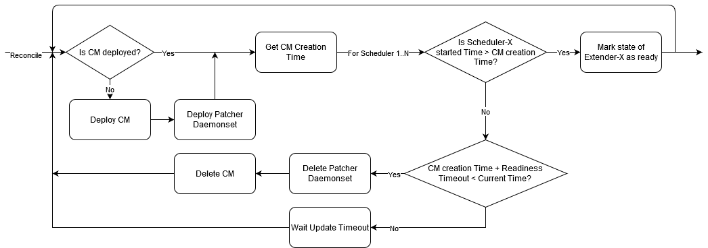
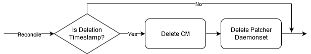
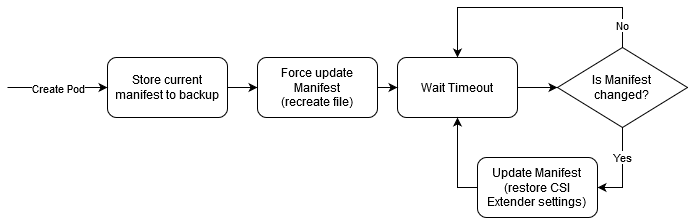
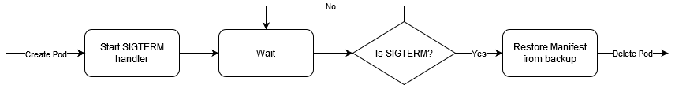

# Proposal: Scheduler-extender readiness check

Last updated: 08.07.2021

## Abstract
CSI must inform user about scheduler-extender deployment status.

## Background
#### Abbreviations
- CM - ConfigMap with policy options 
  (for Openshift - ConfigMap in `openshift-config` namespace used in Scheduler, for vanilla/RKE - internal configmap mounted in Patcher)
- kube-scheduler - Pod with name `(openshift-)kube-scheduler-<node_name>`
- extender - CSI scheduler-extender pod/daemonset

#### Current implementation
Extender will be completely installed on the system after kube-scheduler will be patched. 
Currently, CSI provides no status if patching is completed successfully or not.

Patching process on supported platforms:

- For RKE/vanilla
1. Deploy CM
2. Deploy csi-baremetal-patcher daemonset. 
   In each patcher:
   - Copy police file from CM to local folder on host
   - Update kubernetes-scheduler manifest (add path to policy into parameters)
    
- For Openshift
1. Deploy CM
2. Update schedulers.config.openshift.io CR with CM name

In the both cases patching triggers kube-scheduler restart. 
If kube-scheduler is not restarted, the extender might not work correctly.
Restart check is implemented in E2E testing, but it's not stable.

#### Patching limitations

If user wants to add another scheduler-extender, he has to manage configs for CSI extender himself.

Manual patching:
- For Openshift
1. Set `scheduler.patcher.enable = false`
2. Update Extenders section in CM, which is currently in use, with CSI extender settings
   (Settings is hardcoded now! User need to find them in .go file)
   
- For RKE/vanilla
1. Set `scheduler.patcher.enable = false`
2. Merge Extenders section from config/policy files into current policy file 
   (for k8s 1.18 - config.yaml and policy.yaml, for k8s 1.19 - config-19.yaml from `schedulerpatcher-config` CM)

If user wants to add another scheduler-extender after CSI Installation, he has to upgrade `csi-baremetal` helm release with `scheduler.patcher.enable = false` and go to step 2 from previous list.

Using CSI patching with other custom extenders may lead to unexpected behavior. Examples for Openshift:
- change CM name in schedulers.config.openshift.io CR - CSI Operator returns error in Reconcile
- update CM content (add another extender) - CSI Operator rewrites it with hardcoded value

#### Others

Scheduler policy, which used for configuring extender, is deprecated in Openshift 4.7 - https://docs.openshift.com/container-platform/4.7/nodes/scheduling/nodes-scheduler-default.html

## Proposal

### Readiness check

#### User API

`csi-baremetal-se-...` pods will be in unready state until CSI Operator will not provide readiness flag for them.
Readiness flag - kube-scheduler is restarted after CM deployed.

#### Implementation

Readiness check in scheduler-extender

Readiness flag - CSI Operator sets `<node_name>=Ready` in shareable `extender-status` ConfigMap, if the related kube-scheduler restarted after CM creation.
Extender can read this information and compare `<node_name>` with value gotten from Pod parameters.

CSI Operator behavior for Openshift Platform

kube-scheduler restart time - `pod.Status.ContainerStatuses[0].State.Running.StartedAt`

Update Timeout and Readiness Timeout will be configurable.
Default values: Update Timeout = 20 sec. Readiness timeout = 20 min.

Corner cases:
- Extenders don't become ready after Readiness Timeout - Operator will recreate CM 
- The ConfigMap was deployed before - Kube-Scheduler pod must restart anyway after updating CM.
If it is not detected, Operator will recreate CM
- A new master node in cluster - a new Kube-Scheduler will use updated configuration from CM and its started time will be after CM creation.

CSI Operator deletion handler for Openshift Platform

CSI Operator behavior for RKE/Vanilla Platform

CSI Operator deletion handler for RKE/Vanilla Platform

Also, Patcher must have the following functionality

Patcher SIGTERM handler

Readiness check behavior is the same for 2 platforms - after CM creation kube-scheduler must restart.

Different places:
1. Deploy ConfigMap
- For Openshift - update scheduler configuration
- For RKE/Vanilla - deploy patcher
2. Try to trigger restart
- For Openshift - recreate configmap
- For RKE/Vanilla - restart the appropriate Patcher (Patcher will force update manifest after start)

Problems:
- a way to force Kube-Scheduler restart in Patcher is not clear

### Manual patching

**For discussion**

Possible solutions:
1. Create clear guidelines for users, how they can add CSI extender without patching.
    - move CM stetting to yaml or other config-file
    - fix Openshift patching disabling 
2. Implement "smart" way for Operator to patch kube-scheduler
    - update configs if it exists already (CM for Openshift, policy file for RKE/vanilla)
    - clear only patched fields on shutdown

## Rationale
### Alternative approach
Implement CSI CR status field (ready/unready), which is updated in Operator.

Patching time:
- For Openshift - Operator checks ConfigMap creation timestamp.
- For Patcher - Operator checks modified time of kube-scheduler manifest from master node annotation.
  (Patcher gets info about the manifest file from os.Stat and annotates the appropriate master node)

Other options to make stable kube-scheduler restart check:

#### Option 1
Trigger restart if config stacked:

2. For Openshift - recreate scheduling configmap after CSI installation
3. For Patcher - add kube-scheduler pod deletion step on first try (maybe only if not changed?)

Disadvantages:
- kube-scheduler deletion action may lead to negative consequences

#### Option 2
For Openshift - same as in the approach 1

For Patcher:
1. Move kube-scheduler restart check to patcher code and integrate it with readiness check.
   - if configs are changed, it checks restart and becomes ready after
   - if configs doesn't need patching, it becomes ready at once

Disadvantages:
- Patcher uses Python language, it's technically complicated to rewrite code for it
- We need to have code for checking restart in 2 places
#### Option 3
Add check based only on patching state and not try to watch on kube-scheduler

- For Openshift - become ready if configmap is actual and Scheduler is updated
- For Patcher - become ready if all patcher-daemonset pods are running and their count equals to kube-schedulers count (control-plane nodes may not provide master labels and pods won't be created at all)

## Open issues (if applicable)
ID | Name | Descriptions | Status | Comments
---| -----| -------------| ------ | --------
ISSUE-1 |   |   |   |   
