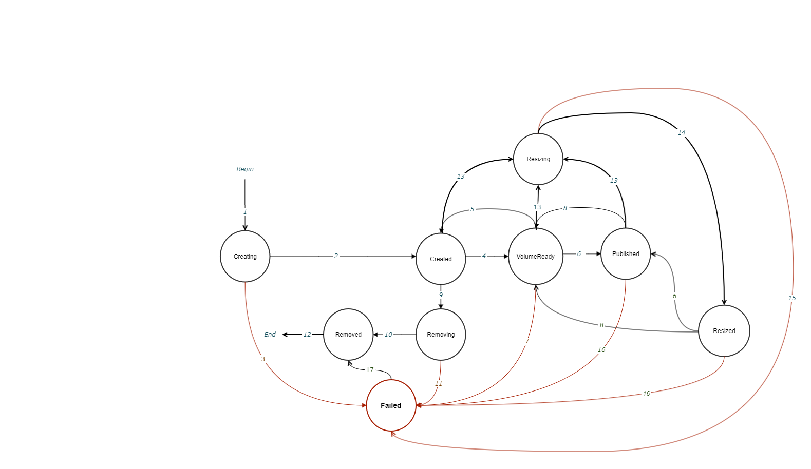

# Proposal: volume statuses

Last updated: 01.02.22

## Background

Volume has the terminated state which is called "Failed". 
This state can be reached by some reason, but there is no way to go out from this state.
Also, it needs to remove Failed volume in the most cases. 
So, this proposal should suggest a work flow to remove Failed volume and its additional statuses, 
if it's required.

## Proposal

The current implementation of volumes' work flow can be found [here](../volume-statuses.md).
It's proposed to add new transition "16" from "Failed" to "Removed" state as the result of handling "DeleteVolume" RPC. 
So, FSM of volume statuses will be like below:

