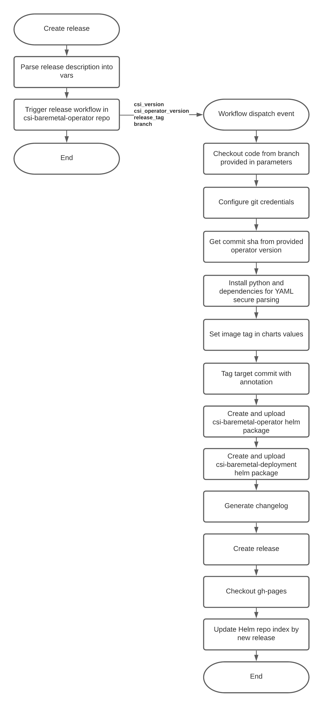

# Release automation

## Purpose
Reduce manually performed operation during csi release procedure.

## Detailed description
Whole release workflow contains 2 parts:
1. Release workflow in current repo triggered on release or pre-release creation
2. Release workflow in [csi-baremetal-operator](https://github.com/dell/csi-baremetal-operator) repo

## Restrictions
* release branches in both repos should have the same names
* release description should has the following format:
`csi_version: <version>, csi_operator_version: <version>`

## Testing strategy
Workflows linting is performed on the [actionlint](https://github.com/rhysd/actionlint) base ([shellcheck](https://github.com/koalaman/shellcheck) is required).
Local workflow testing can be performed with [Act](https://github.com/nektos/act).

Steps to run tests:
1. `make prepare-env` will download and install mentioned tools
2. `make workflows-lint` will lint ==all== workflows in `.github/workflows` dir. It's possible to lint certain workflow (as described [here](https://github.com/rhysd/actionlint/blob/main/docs/usage.md#actionlint-command)), but I found better to lint all at once as it's fast enough.
3. Create file `.github/workflows/tests/wf.secrets` with GITHUB_TOKEN variable definition. Token is generated on [token page of GitHub user settings](https://github.com/settings/tokens). Required permissions: repo, workflow.
4. Login to ghcr.io with GH username and GITHUB_TOKEN: `echo $(cat .github/workflows/tests/wf.secrets | awk -F "=" '{print $2}') | docker login ghcr.io -u USERNAME --password-stdin`
5. `make test-release-workflow` will run workflow locally and execute all steps except marked as `${{ !env.ACT }}`

Release workflow in csi-baremetal-operator workflow test is started by the following cmd in csi-baremetal-operator dir:
`make test-release-workflow`

## Workflow usage
Steps to create release with all necessary artefacts, changelog and update gh-pages with release-workflow:
1. Manually create release in this repo choosing necessary tag, target branch, fill release title and description using the following format:
`csi_version: <version>, csi_operator_version: <version>` (it'd be possible to avoid providing versions here after the next workflow improvement)
2. Tick 'This is a pre-release' if currently releasing versions aren't GA.
3. After finishing of release workflow (in csi-baremetal-operator repo) verify newly created release [here](https://github.com/dell/csi-baremetal-operator/releases)
