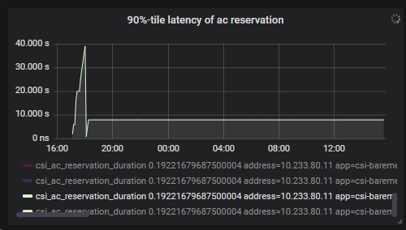

# Scalability testing results

### Kubernetes cluster info
- 3 Master nodes (8 vCPU, 32768 RAM)
- 100 Worker nodes (2 vCPU, 2048 RAM)
- vanilla 1.19.7

### Case (full capacity)
#### Inputs
- CSI deployed on nodes 1-40 using nodeSelectors
- Loopback manager with 3 HDD 100 Mi vDrives
- Application - 40 replicas with 3 HDD volumes
#### Result
##### Problem 1
ACRs stacked in REJECTED after 16h:
```
root@csi-scale-mgmt:~# kubectl get acr
NAME             NAMESPACE   STATUS
default-web-18   default     REJECTED
default-web-22   default     REJECTED
default-web-25   default     REJECTED
default-web-5    default     REJECTED
root@csi-scale-mgmt:~# kubectl get po | grep Pending
web-18        0/1     Pending       0          21h
web-22        0/1     Pending       0          21h
web-25        0/1     Pending       0          21h
web-5         0/1     Pending       0          21h
```
RCA 1:
1. Some ACRs became REJECTED due to reservation process (capacity is reserved on all nodes in request)
2. If ACR is not reserved, extender returns empty node list, which means no empty resources
3. Scheduler repeats request with longer timeout (1s, 40s, 6min, 17min, 1h+)

RCA 2:
1. Extender gives request with nodes, which have no disks
```go
Oct 12 08:48:29.194 [INFO] [KubeClient] [UpdateCR] [e9575934-f2af-41bd-8d56-278f124cabc4] Updating CR , &{{ } {default-web-25   /apis/csi-baremetal.dell.com/v1/availablecapacityreservations/default-web-25 60957849-5178-4124-9ab0-33b3f1273e13 11478007 1286 2021-10-11 20:50:54 +0000 UTC <nil> <nil> map[] map[] [] []  [{controller Update csi-baremetal.dell.com/v1 2021-10-12 08:48:18 +0000 UTC FieldsV1 &FieldsV1{Raw:*[123 34 102 58 115 112 101 99 34 58 123 34 102 58 83 116 97 116 117 115 34 58 123 125 125 125],}} {extender Update csi-baremetal.dell.com/v1 2021-10-12 08:48:18 +0000 UTC FieldsV1 &FieldsV1{Raw:*[123 34 102 58 115 112 101 99 34 58 123 34 46 34 58 123 125 44 34 102 58 78 97 109 101 115 112 97 99 101 34 58 123 125 44 34 102 58 78 111 100 101 82 101 113 117 101 115 116 115 34 58 123 34 46 34 58 123 125 44 34 102 58 82 101 113 117 101 115 116 101 100 34 58 123 125 125 44 34 102 58 82 101 115 101 114 118 97 116 105 111 110 82 101 113 117 101 115 116 115 34 58 123 125 125 125],}}]} {default REQUESTED Requested:"5a160e0a-6ae7-4b15-bf67-1c1c06825054"  [CapacityRequest:<Name:"www-web-25" StorageClass:"ANY" Size:62914560 >  CapacityRequest:<Name:"data-web-25" StorageClass:"ANY" Size:62914560 >  CapacityRequest:<Name:"logs-web-25" StorageClass:"ANY" Size:62914560 > ] {} [] 0}}
Oct 12 08:48:29.207 [INFO] [Extender] [FilterHandler] [e9575934-f2af-41bd-8d56-278f124cabc4] Construct response. Get 1 nodes in request. Among them suitable nodes count is 0. Filtered out nodes - map[]

root@csi-scale-mgmt:~# kubectl get ac | grep 5a160e0a-6ae7-4b15-bf67-1c1c06825054
root@csi-scale-mgmt:~# kubectl get csibmnode | grep 5a160e0a-6ae7-4b15-bf67-1c1c06825054
csibmnode-5a160e0a-6ae7-4b15-bf67-1c1c06825054   5a160e0a-6ae7-4b15-bf67-1c1c06825054   vcloud-csi-worker60    10.52.216.38
```

##### Problem 2

CSI Controller placed on worker node with less resources due to nodeSelector
```
csi-baremetal-controller-7f6c95594c-m6vx4                   4/4     Running             36         22h     10.233.80.11    vcloud-csi-worker8    <none>           <none>
```
Volumes stacked in REMOVED for a long time (10mins+)
```
root@csi-scale-mgmt:~# kubectl get volume
NAME                                       SIZE        STORAGE CLASS   HEALTH   CSI_STATUS   LOCATION                               NODE
pvc-0531a6cf-2531-4461-a84e-1d742b65980f   105906176   HDD             GOOD     REMOVED      5b1cf00b-f93a-46c6-9826-1d245925f2b4   4a62efc8-89e3-49f0-abd4-c90682e42317
pvc-14eea39f-1f48-4a01-a374-4a3e26eb22a8   105906176   HDD             GOOD     REMOVED      e80f4552-25c5-4c52-99e1-0437386a2931   30081e1c-2dfc-42a1-8475-abf0fcbd8838
pvc-15f11f7c-cd85-4c2f-8916-04f4abc6e47e   105906176   HDD             GOOD     REMOVED      7553ea40-60dc-4e73-b538-1d264c7ca0ea   dc678ee9-be9f-4e9b-8f8d-abb731395275
```

##### Problem 3

Reservation metrics are not readable. Metrics from extender are broken.

Chart


Report
```
csi_ac_reservation_duration 0.0253125 
address=10.233.80.11 
app=csi-baremetal 
cni.projectcalico.org/containerID=90aaeb19a83ad846369178c59138cea43ededb636ba3f5c0ddaf529e3a719318 
host=csi-monitoring-telegraf-779c9c9ccd-nvvl9 
method=UpdateReservation 
name=csi-baremetal-controller n
amespace=default 
pod_name=csi-baremetal-controller-7f6c95594c-m6vx4 
release=csi-baremetal-controller 
url=http://10.233.80.11:8787/metrics 
Min:0 ns Max:19.0000 s
```

#### Suggestions
1. Improve logging in Extender (print node names, attach all logs in session to pod name)
2. Make POC of using Custom Scheduler/ Space Capacity features
3. Can we have separate selector for Controller?

### Case (extra capacity)
#### Inputs
- CSI deployed on nodes 1-60 using nodeSelectors
- Loopback manager with 12 HDD 100 Mi vDrives
- Application - 60 replicas with 3 HDD volumes

#### Result
Most of the volumes are in FAILED state due to timeout (10 mins)
```
root@csi-scale-mgmt:~# kubectl get volumes
NAME                                       SIZE        STORAGE CLASS   HEALTH   CSI_STATUS   LOCATION                               NODE
pvc-019cf3ee-7dfb-4212-bade-74d927452772   105906176   HDD             GOOD     FAILED       07e0e6b9-c383-4778-981b-ab829b298494   dc563b87-1b0c-42e0-87f9-dd00200bf5ba
pvc-032994e8-faab-48ee-9f48-abcd2e896894   105906176   HDD             GOOD     FAILED       01ad70a5-a0ea-46d7-8898-0856197fb0d6   de8c27a8-3051-4c57-b217-b02c9fc803e7
pvc-037fe841-f3b0-41c9-91c5-85f101552760   105906176   HDD             GOOD     FAILED       6b6596a0-3cff-44b5-8e0f-cbb9269045a0   d8972192-bb3b-4584-9bd0-96f608abbedf
pvc-06ba8e68-790a-4066-a6cf-e89ae3b24ef2   105906176   HDD             GOOD     CREATED      074426bf-2758-4202-8c31-341b2304b274   d718e367-1ec3-42d3-833a-49c68383fcd7
pvc-0893fab0-1649-429c-9360-0ff1296fa7ec   105906176   HDD             GOOD     FAILED       6a92221b-a88a-48d4-a5f7-81bff4ffb786   2632ce81-e863-4248-842f-cd32100c738e
```

New requests are rejected
```
Oct 13 08:24:39.219 [ERRO] [CSIControllerService] [CreateVolume] [pvc-019cf3ee-7dfb-4212-bade-74d927452772] Failed to create volume: corresponding volume CR pvc-019cf3ee-7dfb-4212-bade-74d927452772 has failed status
```

#### Suggestions
1. Make CreateVolume repeatable 
