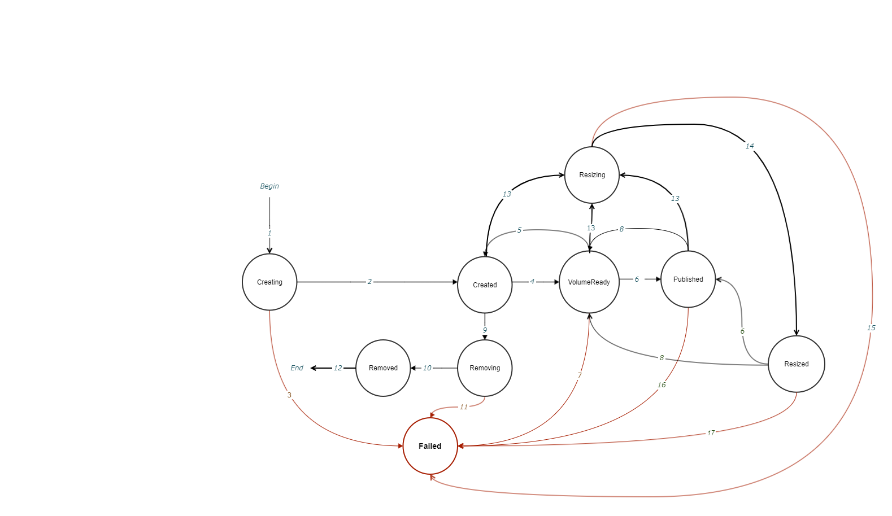

# Volume statuses

Last updated: 01.02.22

## Abstract

Every object can be created and have many states during its life.
Transfer from one state to another should be described by final state machine (FSM).
This document describes implemented volume statuses which should provide CSI workflow.

## Background

CSI specification doesn't make restrictions for volume statuses.
It only suggests the lifecycle of a volume, but implementation of the all RPC-es has to be mandatory.

## Implementation details

It's been proposed to use special field of volume structure where volume status can be stored.
That field is called "CSIStatus":
```go
type Volume struct {
	Id                   string
	Owners               []string
	...
	CSIStatus            string 
	...
```
Now it has the next volume statuses:
* Creating;
* Created;
* VolumeReady;
* Published;
* Removing;
* Removed;
* Failed;
* Resizing;
* Resized.

FSM of volume statuses is shown below:



Statuses transition list:
1. Volume CR has been created as the result of "CreateVolume" RPC call.
2. Volume has been created as the result of routine call from Reconcile of Volume Manager.
3. Something went wrong during volume creation.
4. "NodeStageVolume" RPC call has been handled successfully.
5. "NodeUnstageVolume" RPC call has been handled successfully.
6. "NodePublishVolume" RPC call has been handled successfully.
7. "NodePublishVolume" RPC call has been failed.
8. "NodeUnpublishVolume" RPC call has been handled successfully.
9. "DeleteVolume" RPC call has been handled successfully.
10. Volume has been deleted as the result of routine call from Reconcile of Volume Manager.
11. Something went wrong during deletion of a volume.
12. Volume CR has been removed as the end of routine of "DeleteVolume" RPC call.
13. "ControllerExpandVolume" has been called.
14. Logical volume has been expanded successfully.
15. Something went wrong during logical volume expansion.
16. Unmount volume has failed in handler of "NodeUnpublishVolume" RPC call.